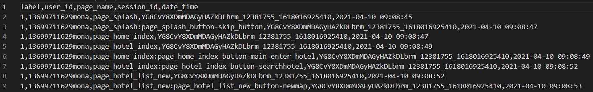
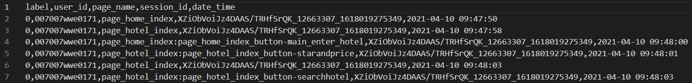

# 项目简介

本项目分为两个部分，第一部分是数据需求和预处理，第二部分是模型部分。

## 数据需求和预处理

详见pre/README.md文件。这里面详细描述了数据格式，处理要求，脚本调用方法。

## 模型部分

### Setup 

First, create a virtual environment: 
`conda create -n ICWS2023`

Once you have confirmed that cuda >= 12.1 is installed, install the cuda 12.1 version of PyTorch using the command: 
`conda install pytorch torchvision torchaudio pytorch-cuda=12.1 -c pytorch-nightly -c nvidia`

Finally, install the required packages using 
`pip install -r requirements.txt`

### Train

下面的所有训练的代码，第一次运行时会生成cache文件。
更改max_seq_len之后需要去掉--use_cache重新运行一遍！！！之后的运行可以指定cache参数。
没更改max_seq_len参数的情况下，可使用--use_cache指定使用参数运行，以加速（不再进行数据处理）。

```bash
python train.py -dataset_root=/home/hiyoungshen/Source/ICWS2023/AbnormalDetection/experiment/preprocess/ \
                -cache_dir /home/hiyoungshen/Source/ICWS2023/AbnormalDetection/experiment/train_data \
                -weight_name model.pkl \
                -data_type pageuser \
                -vocab_dict_path experiment/assets/page2idx.json \
                -max_seq_len 300 \
                -vocab_size 10000 \
                -backbone transformer \
                -embedding_dim 360 \
                -ffn_num_hiddens 1440 \
                -num_heads 4 \
                -num_layers 2 \
                -dropout 0.5 \
                -criterion WeightedBCE \
                -weight 0.01 0.99 \
                -sampler balanced \
                -lr 0.0002 \
                -epochs 2 \
                -steps_per_epoch 40 \
                -batch_size 128 \
                -train_ratio 0.8
```

参数解析：
* -dataset_root，设置为数据集所在文件夹的绝对地址/相对地址，这个文件夹下应该有两个文件。
  * 一个名为feedback,csv，其格式例如。
    * 第一列label为标签，全为1。代表feedback样本均为异常样本。
    * 第二列user_id为用户的id。每一个user_id唯一的确认一个一个用户。
    * 第三列page_name为页面的名称，每一个页面名称唯一的确认一个页面。
    * 第四列session_id为session的id，每一个session_id唯一的确认一个session。
    * 第五列date_time，需要为标准的date_time的时间格式。
  * 一个名为normal.csv，其格式例如。
    * 第一列label为标签，全为0。代表normal样本均为正常样本。
    * 第二列user_id为用户的id。每一个user_id唯一的确认一个一个用户。
    * 第三列page_name为页面的名称，每一个页面名称唯一的确认一个页面。
    * 第四列session_id为session的id，每一个session_id唯一的确认一个session。
    * 第五列date_time，需要为标准的date_time的时间格式。
* -cache_dir，不加上--user_cache选项时候，会依据-dataset_root下面的两个文件，即feedback,csv和normal.csv两个文件生成cache，存储在-cache_dir指定的文件夹下下的cache文件夹中。
* -weight_name，指定训练生成的模型的名称，默认为model.pkl。会存放在-cache_dir指定的文件夹下的models文件夹中。
* --use_cache，指定是否使用cache，若在-cache_dir指定的文件夹下没有cache文件夹，会报错，第一次运行不加--user_cache文件夹，会在-cache_dir指定的文件夹下生成cache文件夹。
* -vocab_dict_path指定页面名称到其编码的字典。
* 其它参数均为模型参数，这里使
用默认即可。**embedding_dim**必须是**num_heads**的倍数。训练的时候，主要可调的参数有**max_seq_len, embedding_dim, ffn_num_hiddens, num_heads, num_layers, batch_size**。

### Test
测试。注意！！！用什么样子的参数训练，就要用什么样子的参数测试。

```bash
python test.py -dataset_root=/home/hiyoungshen/Source/ICWS2023/AbnormalDetection/experiment/preprocess/ \
                -cache_dir /home/hiyoungshen/Source/ICWS2023/AbnormalDetection/experiment/test_data \
                -weight_name model.pkl \
                -file_name_abnormal feedback.csv \
                -file_name_normal normal.csv \
                --use_cache \
                -test_set train \
                -data_type pageuser \
                -vocab_dict_path experiment/assets/page2idx.json \
                -max_seq_len 300 \
                -vocab_size 10000 \
                -backbone transformer \
                -embedding_dim 360 \
                -ffn_num_hiddens 1440 \
                -num_heads 4 \
                -num_layers 2 \
                -dropout 0.5 \
                -criterion WeightedBCE \
                -weight 0.01 0.99 \
                -sampler balanced \
                -lr 0.0002 \
                -epochs 2 \
                -steps_per_epoch 40 \
                -batch_size 128 \
                -train_ratio 0.8
```