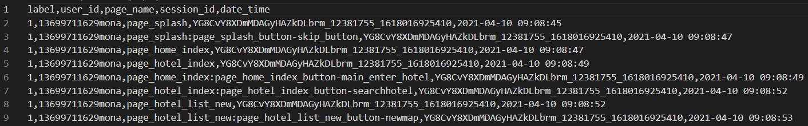

# 准备数据

* 准备好文件夹，文件夹中放好两个文件，一个是feedback.csv文件，一个是normal.csv文件。
* feedback.csv文件和normal.csv两个文件的内容应该是**正交的**，即feedback.csv文件中的user_id和session_id不应该在normal.csv中出现，normal.csv文件中的user_id和session_id不应该在feedback.csv中出现。
* feedback.csv文件和normal.csv两个文件中不应该存在nan。
* 

* 一个名为feedback,csv，其格式例如。
  * 第一列label为标签，全为1。代表feedback样本均为异常样本。
  * 第二列user_id为用户的id。每一个user_id唯一的确认一个一个用户。
  * 第三列page_name为页面的名称，每一个页面名称唯一的确认一个页面。
  * 第四列session_id为session的id，每一个session_id唯一的确认一个session。
  * 第五列date_time，需要为标准的date_time的时间格式。
* 一个名为normal.csv，其格式例如。
  * 第一列label为标签，全为0。代表normal样本均为正常样本。
  * 第二列user_id为用户的id。每一个user_id唯一的确认一个一个用户。
  * 第三列page_name为页面的名称，每一个页面名称唯一的确认一个页面。
  * 第四列session_id为session的id，每一个session_id唯一的确认一个session。
  * 第五列date_time，需要为标准的date_time的时间格式。

# 预预处理

预预处理做的事情：
1. 对url的预处理（去除url中的汉字、去除所有的url中文编码、去除所有逗号、去除所有~、去除参数、整理url、大小变小写）
2. 在大写变小写之前，生成lowercase2uppercase.json文件

**预预处理对训练数据和测试数据都要做！！！**

```bash
python prepreprocess.py -in_dir_prepre /home/hiyoungshen/Source/Archive/ICWS2023/experiment/datasets \
                        -feedback_names_prepre feedback.csv  \
                        -normal_names_prepre normal.csv  \
                        -output_dir_prepre ../experiment/prepreprocess/ \
                        -output_set_prepre ../experiment/assets/
```

预预处理的步骤可以在获取数据的时候就做完。

# 筛除页面的准备条件

根据预预处理得到的文件生成页面频率的统计的统计。这里生成了page2num.json文件。

**只需要对训练数据做，做完了之后既要给训练数据用，又需要将生成的文件拿给测试数据用。**

```bash
python g_page2num.py -in_dir_gen ../experiment/prepreprocess/ \
                     -feedback_names_gen feedback.csv  \
                     -normal_names_gen normal.csv  \
                     -output_dir_gen ../experiment/assets/ \
                     -page2num_names_gen page2num.json
```

根据生成的文件的编码生成单词频率的统计。

```bash
python g_lastword_dict.py -page2num_dir ../experiment/assets/ \
                        -page2num_names page2num.json \
                        -output_dir_lastword ../experiment/assets/ \
                        -lastword_dict_names lastword_dict.json
```

# 给页面进行编码

根据lastword_dict.json文件生成页面的编码.

**只需要对训练数据做，做完了之后既要给训练数据用，又需要将生成的文件拿给测试数据用。**

```bash
python g_page_code.py -lastword_dict_dir ../experiment/assets/ \
                -lastword_dict_name lastword_dict.json \
                -output_dir_lastword_dict ../experiment/assets/
```

# 跑训练之前

需要对训练和测试数据做和生成字典同样的预处理

## run preprocess.py

**对训练数据和测试数据都要做（且操作需要和g_page_code.py中的操作对应上，这里已经对应上）。**

```bash
python preprocess.py -in_dir_pre ../experiment/prepreprocess/ \
                     -feedback_names_pre feedback.csv  \
                     -normal_names_pre normal.csv  \
                     -output_dir_pre ../experiment/preprocess/
```